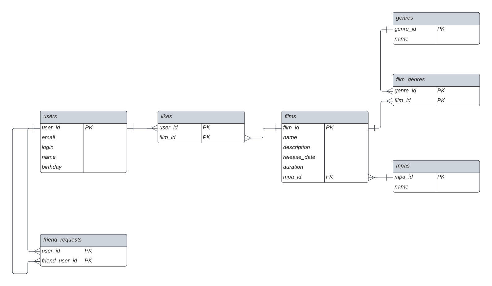

# java-filmorate
## ER-диаграмма

[Редактировать ER-диаграмму](https://lucid.app/lucidchart/2d76cf7b-b300-4f7a-be7a-60097ea4bfed/edit?viewport_loc=-635%2C-426%2C1602%2C865%2C0_0&invitationId=inv_8fa8d14d-4b58-41bb-be1c-7b8e4d6f402a)

#### Описание таблиц
user - пользователи.

friend_request - запросы на добавление в друзья. Нужна для связи пользователей многие ко многим. С помощью нее можно получить список друзей.

film - фильмы.

like - лайки. Нужна для связи многие ко многим между пользователями и фильмами. С ее помощью можно определить какой пользователь поставил лайки каким фильмам.

rating - рейтинг фильмов. Нужна для связи один ко многим между рейтингом и фильмами.

film_genre - жанры, к которым принадлежит фильм. Нужна для свзи многие ко многим между фильмами и жанрами.

genre - жанры.

#### Примеры запросов

Список логинов друзей пользователя с id = 1.

```
SELECT DISTINCT u.login
FROM friends_request AS f
INNER JOIN user AS u ON f.friend_user_id = u.user_id
WHERE (f.user_id = 1) AND (f.status = 'accepted')
UNION
SELECT DISTINCT u.login
FROM friends_request AS f
INNER JOIN user AS u ON f.user_id = u.user_id
WHERE (f.friend_user_id = 1) AND (f.status = 'accepted')
```

 Количество фильмов для каждого рейтинга.

```
SELECT count(f.film_id)
FROM film AS f
INNER JOIN rating AS r ON f.rating_id = r.rating_id
GROUP BY f.rating_id
```

Список названий жанров для фильма с названием "Титаник".

```
SELECT g.name
FROM genre AS g
INNER JOIN film_genre AS fg ON g.genre_id = fg.genre_id
INNER JOIN film AS f ON fg.film_id = f.film_id
WHERE f.name = 'Титаник'
```

Названия топ 10 фильмов по количеству лайков.

```
SELECT f.name,
       count(l.film_id) AS film_likes
FROM like AS l
INNER JOIN film AS f ON l.film_id = f.film_id
GROUP BY l.film_id, f.name
ORDER BY film_likes DESC
LIMIT 10;
```